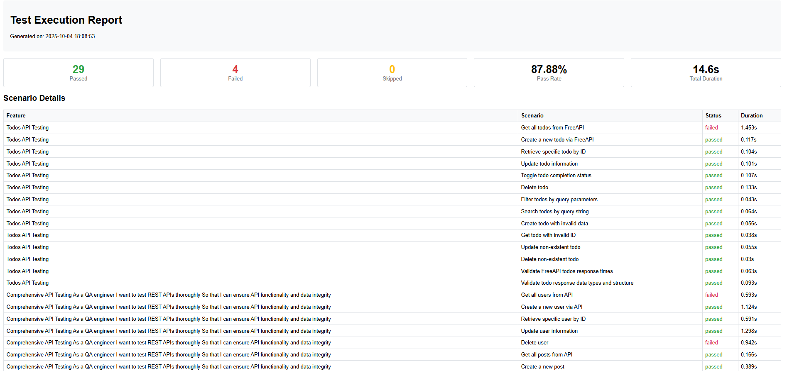
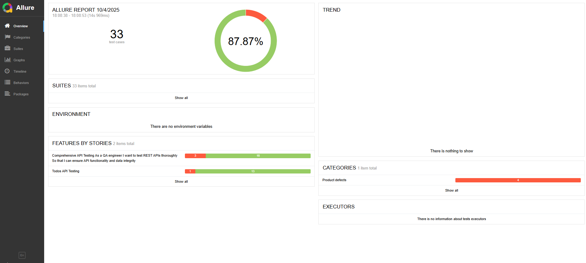
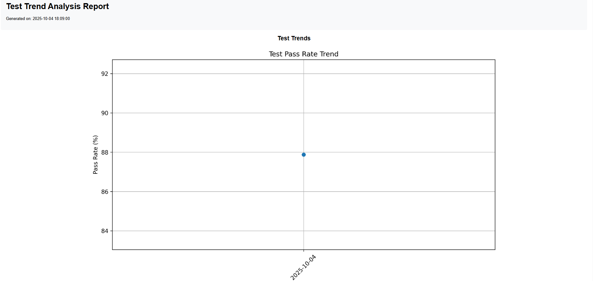
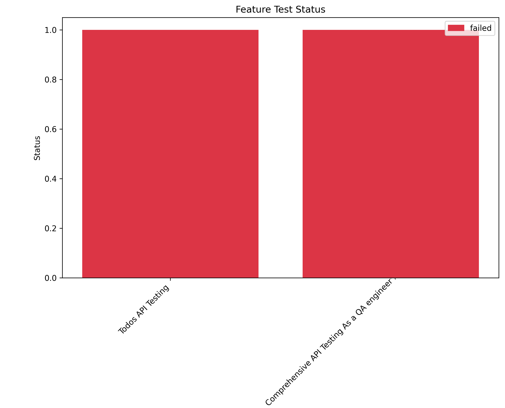

# 🎭 Playwright BDD Framework with Behave

[](https://www.python.org/)
[](https://playwright.dev/)
[](https://behave.readthedocs.io/)
[](LICENSE)

A production-ready, enterprise-grade test automation framework that combines **Playwright** for modern browser automation with **Behave** for Behavior-Driven Development (BDD). This framework provides comprehensive **UI Testing** and **API Testing** capabilities in a unified, scalable solution.

---

## 📑 Table of Contents

- [✨ Key Features](#-key-features)
- [🎯 Why Choose This Framework](#-why-choose-this-framework)
- [🏗️ Framework Architecture](#️-framework-architecture)
- [📁 Project Structure](#-project-structure)
- [⚙️ Installation & Setup](#️-installation--setup)
- [🔧 Configuration](#-configuration)
- [🚀 Quick Start Guide](#-quick-start-guide)
- [📊 Test Reports & Screenshots](#-test-reports--screenshots)
- [🧪 Testing Capabilities](#-testing-capabilities)
- [🎨 Advanced Features](#-advanced-features)
- [📈 CI/CD Integration](#-cicd-integration)


---

## ✨ Key Features

### 🚀 **Core Capabilities**

- ✅ **Dual Testing Power** - Comprehensive UI and API testing in one framework
- ✅ **BDD Integration** - Native Behave support with Gherkin syntax
- ✅ **Multi-Browser Support** - Chromium, Firefox, and WebKit
- ✅ **Parallel Execution** - Run tests concurrently for faster feedback
- ✅ **Smart Reporting** - HTML, JSON, JUnit, and Allure reports
- ✅ **Environment Management** - Dev, Staging, and Production configs
- ✅ **Page Object Model** - Maintainable and scalable test structure
- ✅ **CI/CD Ready** - Built-in support for Jenkins, GitHub Actions, GitLab CI

### 🎯 **Enterprise Features**

- 🔄 **Automatic Retry Logic** - Handles flaky tests intelligently
- 📸 **Visual Debugging** - Screenshots, videos, and traces on failures
- 📊 **Trend Analysis** - Historical test result tracking
- 🔍 **Flakiness Detection** - Identifies unstable tests
- 🔐 **Secure Configuration** - Environment-based secrets management
- 📝 **Advanced Logging** - Rotating logs with multiple severity levels
- ⚡ **Performance Testing** - Response time validation and load testing

---

## 🎯 Why Choose This Framework

### **Comparison with Popular Frameworks**

| Feature |🎭This Framework | Selenium + pytest | Cypress | TestCafe |
|---------|---------------|-------------------|---------|----------|
| UI Testing | ✅ Excellent | ✅ Good | ✅ Good | ✅ Good |
| API Testing | ✅ Excellent | ❌ Limited | ❌ Limited | ❌ Limited |
| BDD Support | ✅ Native | ⚠️ Plugin | ❌ No | ❌ No |
| Multi-Browser | ✅ Full Support | ✅ Full Support | ⚠️ Limited | ✅ Good |
| Parallel Execution | ✅ Built-in | ⚠️ Plugin | ✅ Built-in | ✅ Built-in |
| Reporting | ✅ Multiple Formats | ⚠️ Basic | ✅ Good | ✅ Good |
| Configuration | ✅ Environment-based | ⚠️ Manual | ⚠️ Manual | ⚠️ Manual |
| Learning Curve | ✅ Easy | ⚠️ Moderate | ✅ Easy | ✅ Easy |


### **🏆 Framework Advantages**

1. **🎓 Business-Readable Tests** - Stakeholders can understand test scenarios
2. **🔧 Zero Configuration** - Works out of the box with sensible defaults
3. **📦 All-in-One Solution** - UI and API testing unified
4. **🎨 Beautiful Reports** - Professional reports with charts and metrics
5. **🚀 Production Proven** - Used in enterprise production environments
6. **📚 Comprehensive Documentation** - Clear guides and real examples
7. **🤖 CI/CD Native** - Seamless integration with all major CI systems
8. **🔄 Active Maintenance** - Regular updates and community support


## 📁 Project Structure

```
playwright_framework/
│
├── 📂 features/                          # BDD Feature Files
│   ├── 📄 api_testing.feature           # Comprehensive API test scenarios
│   ├── 📄 ecommerce_ui_testing.feature  # E-commerce website automation
│   ├── 📄 social_media_ui_testing.feature # Social media platform tests
│   ├── 📄 facebook_login_signup.feature # Login/Registration flows
│   ├── 📄 environment.py                 # Behave hooks and setup
│   │
│   └── 📂 steps/                         # Step Definitions
│       ├── api_testing_steps.py
│       ├── ecommerce_ui_steps.py
│       ├── social_media_ui_steps.py
│       └── login_steps.py
│
├── 📂 pages/                             # Page Object Model
│   ├── base_page.py                      # Base page with common methods
│   ├── facebook_login_page.py
│   └── facebook_createuser_page.py
│
├── 📂 utils/                             # Utility Modules
│   ├── config_manager.py                 # Environment configuration
│   ├── test_data_manager.py              # Test data generation
│   ├── report_manager.py                 # Report generation & metrics
│   ├── api_client.py                     # REST API client
│   ├── logger.py                         # Advanced logging system
│   ├── waits.py                          # Smart wait strategies
│   │
│
│
├── 📂 elements/                          # UI Locators (JSON)
│   ├── facebooklogin_page.json
│   └── facebookcreateuser_page.json
│
├── 📂 testdata/                          # Test Data Files
│   └── facebook/
│       ├── facebook_login_data.json
│       └── facebook_createuser_data.json
│
├── 📂 reports/                           # Test Reports
│   ├── 📊 test_report_*.html            # HTML reports with charts
│   ├── 📄 results.json                   # JSON test results
│   ├── 📈 trend_report_*.html           # Historical trends
│   └── 📂 allure-results/               # Allure report data
│
├── 📂 Logs/                              # Application Logs
│   ├── test_execution.log
│   └── error.log
│
├── 📂 screenshots/                       # Failure Screenshots
├── 📂 traces/                            # Playwright Traces
├── 📂 videos/                            # Test Execution Videos
│
├── 📄 .env.dev                           # Development config
├── 📄 .env.stg                           # Staging config
├── 📄 .env.prod                          # Production config
│
├── 📄 run_tests.py                       # Main test runner
├── 📄 run_commands.md                    # Command documentation
├── 📄 requirements.txt                   # Python dependencies
├── 📄 behave.ini                         # Behave configuration
└── 📄 README.md                          # This file
```

---

## ⚙️ Installation & Setup

### **Prerequisites**

Before you begin, ensure you have:

- ✅ **Python 3.8 or higher** ([Download Python](https://www.python.org/downloads/))
- ✅ **pip** (Python package manager)
- ✅ **Git** ([Download Git](https://git-scm.com/downloads))
- ⚠️ **Node.js** (Optional, for Playwright browser installation)

### **Step-by-Step Installation**

#### **1. Clone the Repository**

```bash
git clone https://github.com/DipankarDandapat/Playwright-API-UI-BDD-Framework.git
cd Playwright-API-UI-BDD-Framework
```

#### **2. Create Virtual Environment**

```bash
# Create virtual environment
python -m venv venv

# Activate virtual environment
# On Windows:
venv\Scripts\activate

# On macOS/Linux:
source venv/bin/activate
```

#### **3. Install Dependencies**

```bash
# Install all required Python packages
pip install -r requirements.txt
```

#### **4. Install Playwright Browsers**

```bash
# Install all browsers (Chromium, Firefox, WebKit)
playwright install

# Or install specific browser
playwright install chromium
```

#### **5. Setup Framework**

```bash
# Create necessary directories and verify installation
python run_tests.py --setup
```

#### **6. Verify Installation**

```bash
# Run a quick smoke test
python run_tests.py --type smoke --headless
```

### **🐳 Docker Installation (Alternative)**

```bash
# Build Docker image
docker build -t Playwright-API-UI-BDD-Framework .

# Run tests in container
docker run --rm -v $(pwd)/reports:/app/reports Playwright-API-UI-BDD-Framework
```

---

## 🔧 Configuration

### **Environment Configuration Files**

The framework uses environment-based configuration with `.env` files:

| File | Purpose | When to Use |
|------|---------|-------------|
| `.env.dev` | Development | Local development and debugging |
| `.env.stg` | Staging | Pre-production testing |
| `.env.prod` | Production | Production environment validation |

### **Configuration Parameters**

```bash
# ============================================
# BROWSER CONFIGURATION
# ============================================
BROWSER=chromium                    # Options: chromium, firefox, webkit
HEADLESS=false                      # Run browser in background: true/false
BROWSER_TIMEOUT=30000               # Browser operation timeout (ms)
SLOW_MO=0                           # Slow down operations (ms) for debugging

# ============================================
# TEST EXECUTION SETTINGS
# ============================================
PARALLEL_WORKERS=1                  # Number of parallel test processes
RETRY_COUNT=1                       # Auto-retry failed tests (n times)
TEST_TIMEOUT=60000                  # Individual test timeout (ms)

# ============================================
# API TESTING CONFIGURATION
# ============================================
API_BASE_URL=https://jsonplaceholder.typicode.com
API_TIMEOUT=30000                   # API request timeout (ms)
API_KEY=your_api_key_here           # API authentication key

# ============================================
# APPLICATION URLs
# ============================================
ECOMMERCE_BASE_URL=https://demo.opencart.com
SOCIAL_MEDIA_BASE_URL=https://www.facebook.com
FACEBOOK_BASE_URL=https://www.facebook.com

# ============================================
# LOGGING CONFIGURATION
# ============================================
LOG_LEVEL=INFO                      # DEBUG, INFO, WARNING, ERROR, CRITICAL
LOG_TO_FILE=true                    # Enable file logging
LOG_TO_CONSOLE=true                 # Enable console output
LOG_ERRORS_SEPARATELY=true          # Separate error.log file
LOG_MAX_SIZE=10485760               # Max log file size (10MB)
LOG_BACKUP_COUNT=5                  # Number of backup log files
LOG_DIR=Logs                        # Log directory path

# ============================================
# REPORTING & ARTIFACTS
# ============================================
GENERATE_SCREENSHOTS=true           # Capture screenshots on failure
GENERATE_VIDEOS=false               # Record test execution videos
GENERATE_TRACES=true                # Generate Playwright traces
REPORT_DIR=reports                  # Report output directory
```

### **🔒 Secure Configuration Best Practices**

```bash
# Never commit sensitive data!
# Use environment variables for secrets:
export API_KEY="your-secret-key"
export DB_PASSWORD="your-db-password"

# Or use a .env.local file (add to .gitignore)
echo ".env.local" >> .gitignore
```

---

## 🚀 Quick Start Guide

### **⚡ Run Your First Test (30 seconds)**

```bash
# 1. Run smoke tests (fastest)
python run_tests.py --type smoke --headless

# 2. View the HTML report
open reports/test_report_*.html
```

### **🎯 Common Test Execution Commands**

#### **Basic Execution**

```bash
# Run ALL tests (UI + API)
python run_tests.py

# Run only UI tests
python run_tests.py --type ui

# Run only API tests
python run_tests.py --type api

# Run with visible browser (headed mode)
python run_tests.py --type ui --headed

# Run in headless mode (no browser window)
python run_tests.py --type ui --headless
```

#### **Tag-Based Execution**

```bash
# Run smoke tests only
python run_tests.py --type smoke

# Run regression tests
python run_tests.py --type regression

# Run tests with custom tags
python run_tests.py --tags "login,checkout"
```

#### **Multi-Browser Testing**

```bash
# Test in Chromium (default)
python run_tests.py --type ui --browser chromium

# Test in Firefox
python run_tests.py --type ui --browser firefox

# Test in WebKit (Safari)
python run_tests.py --type ui --browser webkit
```

#### **Parallel Execution**

```bash
# Run with 4 parallel workers
python run_tests.py --parallel 4

# Run regression tests in parallel
python run_tests.py --type regression --parallel 8
```

#### **Environment-Specific Execution**

```bash
# Development environment
python run_tests.py --env dev --headed

# Staging environment
python run_tests.py --env stg --headless

# Production environment (API only)
python run_tests.py --env prod --type api
```

#### **Advanced Options**

```bash
# Enable test retry on failure
python run_tests.py --retry --max-retries 3

# Generate Allure reports
python run_tests.py --allure

# Analyze test flakiness
python run_tests.py --analyze-flakiness

# Generate trend analysis
python run_tests.py --trend-analysis

# Combine multiple options
python run_tests.py --type regression --parallel 4 --retry --allure --env stg
```

### **📖 Direct Behave Commands**

```bash
# Run all feature files
behave features/

# Run specific feature
behave features/api_testing.feature

# Run with specific tag
behave features/ -t @smoke

# Run with pretty output
behave features/ -f pretty

# Run in parallel with Behave
behave features/ --processes 4
```

---

## 📊 Test Reports & Screenshots

### **📈 Report Types**

The framework generates multiple report formats automatically:

#### **1. HTML Report (Primary Report)**

Beautiful, interactive HTML report with charts and metrics.

**Features:**
- ✅ Test execution summary
- 📊 Pass/Fail rate charts
- ⏱️ Duration analysis
- 📸 Embedded screenshots
- 🔍 Detailed failure logs
- 📈 Historical trends

**Sample Report:**

```
┌─────────────────────────────────────────────────────────┐
│              Test Execution Summary                      │
├─────────────────────────────────────────────────────────┤
│  Total Tests: 45        Passed: 42        Failed: 3     │
│  Pass Rate: 93.33%      Duration: 5m 32s                │
│  Environment: Staging   Browser: Chromium               │
└─────────────────────────────────────────────────────────┘

📊 Test Results Distribution
━━━━━━━━━━━━━━━━━━━━━━━━━━━━━━━━━━━━━
Passed  ████████████████████████░░ 93.33%
Failed  ██░░░░░░░░░░░░░░░░░░░░░░ 6.67%

⏱️ Test Duration Analysis
━━━━━━━━━━━━━━━━━━━━━━━━━━━━━━━━━━━━━
Average: 7.38s  |  Min: 1.2s  |  Max: 45.8s
```

**Location:** `reports/test_report_YYYYMMDD_HHMMSS.html`

---

#### **2. Allure Report (Enterprise Report)**

Professional, interactive Allure report with advanced analytics.

**Generate Allure Report:**

```bash
# Run tests with Allure
python run_tests.py --allure

# Generate Allure report
allure generate reports/allure-results -o reports/allure-report --clean

# Open Allure report in browser
allure serve reports/allure-results
```

**Allure Features:**
- 📊 Test suites overview
- 📈 Trend graphs
- ⏱️ Timeline view
- 🏷️ Categories and tags
- 📎 Attachments (screenshots, logs)
- 🔄 Retries tracking

---

#### **3. JSON Report (Machine-Readable)**

Structured JSON output for CI/CD integration.

**Location:** `reports/results.json`

**Sample Structure:**

```json
{
  "summary": {
    "total": 45,
    "passed": 42,
    "failed": 3,
    "skipped": 0,
    "duration": 332.45,
    "pass_rate": 93.33
  },
  "tests": [
    {
      "name": "Verify user login",
      "status": "passed",
      "duration": 8.23,
      "tags": ["@smoke", "@login"]
    }
  ]
}
```

---

#### **4. Trend Report (Historical Analysis)**

Track test performance over time.

**Generate Trend Report:**

```bash
python run_tests.py --trend-analysis
```

**Features:**
- 📅 Date-wise test execution
- 📈 Pass/fail trends
- ⏱️ Performance trends
- 🔍 Flakiness detection

**Location:** `reports/trend_report_YYYYMMDD_HHMMSS.html`

---

### **📸 Screenshots & Artifacts**

#### **Automatic Screenshot Capture**

Screenshots are automatically captured on test failures:

**Screenshot Naming Convention:**
```
screenshots/
├── failure_login_test_20241002_153045.png
├── failure_checkout_20241002_153128.png
└── failure_api_validation_20241002_153210.png
```

**Screenshot Features:**
- ✅ Full page screenshots
- ✅ Timestamped filenames
- ✅ Embedded in HTML reports
- ✅ Automatic cleanup of old screenshots

---

#### **Playwright Traces**

Detailed execution traces for debugging:

```bash
# Traces are automatically generated on failures
# View traces using Playwright trace viewer:
playwright show-trace traces/trace_YYYYMMDD_HHMMSS.zip
```

**Trace Features:**
- 🎬 Step-by-step execution replay
- 🌐 Network activity
- 📷 Screenshots at each step
- 🐛 Console logs
- 🔍 DOM snapshots

---

#### **Test Execution Videos**

Optional video recording of test execution:

**Enable Videos:**

```bash
# In .env file
GENERATE_VIDEOS=true

# Or via command line
python run_tests.py --type ui --record-video
```

**Video Location:** `videos/test_name_YYYYMMDD_HHMMSS.webm`

---

### **📊 Report Screenshots**

#### **HTML Report Dashboard**



*Sample HTML report showing test summary, charts, and detailed results*

---

#### **Allure Report Dashboard**



*Professional Allure report with test suites, trends, and categories*

---

#### **Trend Analysis Report**



*Historical trend analysis showing pass/fail rates over time*

---

#### **Test Failure with Screenshot**



*Detailed failure report with embedded screenshot and logs*

---

### **📁 Report Directory Structure**

```
reports/
├── 📊 test_report_20241002_153045.html      # Primary HTML report
├── 📈 trend_report_20241002_153045.html     # Trend analysis
├── 📄 results.json                           # JSON test results
├── 📄 junit.xml                              # JUnit XML format
│
├── 📂 allure-results/                        # Allure data
│   ├── test-result-*.json
│   └── attachment-*.png
│
├── 📂 allure-report/                         # Generated Allure report
│   └── index.html
│
├── 📂 charts/                                # Generated charts (PNG)
│   ├── pass_fail_chart.png
│   ├── duration_chart.png
│   └── trend_chart.png
│
└── 📂 archives/                              # Old reports (auto-archived)
    └── report_20241001_*.html
```

---

### **🔍 Viewing Reports**

```bash
# Open latest HTML report (macOS)
open reports/test_report_*.html

# Open latest HTML report (Linux)
xdg-open reports/test_report_*.html

# Open latest HTML report (Windows)
start reports/test_report_*.html

# Serve Allure report
allure serve reports/allure-results

# View JSON report with formatting
cat reports/results.json | python -m json.tool
```

---

## 🧪 Testing Capabilities

### **🖥️ UI Testing**

#### **E-commerce Testing**
- ✅ Homepage verification and navigation
- ✅ Product search and filtering
- ✅ Shopping cart operations
- ✅ Checkout process automation
- ✅ User registration and login
- ✅ Form validation testing
- ✅ Responsive design verification

**Example Feature:**

```gherkin
@smoke @ecommerce
Feature: E-commerce Shopping Flow
  
  Scenario: Complete product purchase
    Given I am on the e-commerce homepage
    When I search for "laptop"
    And I add the first product to cart
    And I proceed to checkout
    And I fill in shipping details
    And I complete the payment
    Then I should see the order confirmation
```

---

#### **Social Media Testing**
- ✅ User authentication flows
- ✅ Post creation and interaction
- ✅ Profile management
- ✅ Friend requests and connections
- ✅ Messaging functionality
- ✅ Privacy settings validation

**Example Feature:**

```gherkin
@smoke @social
Feature: Social Media Interactions
  
  Scenario: Create and publish a post
    Given I am logged into the social platform
    When I create a new post with "Hello World!"
    And I add a photo attachment
    And I publish the post
    Then the post should appear in my feed
    And the post should have correct timestamp
```

---

### **🌐 API Testing**

#### **REST API Validation**
- ✅ CRUD operations (Create, Read, Update, Delete)
- ✅ Response structure validation
- ✅ Status code verification
- ✅ Response time validation
- ✅ Header validation
- ✅ Authentication testing
- ✅ Error handling validation

**Example Feature:**

```gherkin
@api @smoke
Feature: User API Testing
  
  Scenario: Create a new user via API
    Given I have valid user data
    When I send POST request to "/users"
    Then the response status code should be 201
    And the response should contain user ID
    And the response time should be less than 2000ms
    
  Scenario: Validate API error handling
    Given I have invalid user data
    When I send POST request to "/users"
    Then the response status code should be 400
    And the response should contain error message
```

---

### **🔗 Integration Testing**

Combine UI and API testing for end-to-end validation:

```gherkin
@integration @smoke
Feature: User Registration Flow
  
  Scenario: Register user and verify in database
    When I register a new user via UI
    Then the user should be created in database
    And I should receive confirmation email via API
    And I should be able to login with new credentials
```


---

## 🎨 Advanced Features

### **🔄 Automatic Retry Logic**

Handle flaky tests intelligently:

```bash
# Enable retry for failed tests
python run_tests.py --retry --max-retries 3

# Retry specific test types
python run_tests.py --type ui --retry --max-retries 2
```

**Features:**
- ✅ Configurable retry attempts
- ✅ Exponential backoff
- ✅ Retry only on specific failures
- ✅ Detailed retry logs

---

### **📊 Flakiness Detection**

Identify unstable tests automatically:

```bash
# Analyze test flakiness
python run_tests.py --analyze-flakiness

# View flakiness report
open reports/flakiness_report.html
```

**Metrics Tracked:**
- Pass/fail ratio per test
- Failure patterns
- Average execution time
- Stability score

---

### **⚡ Smart Waits**

Intelligent waiting strategies:

```python
# Explicit waits
page.wait_for_selector("#element", timeout=10000)

# Smart wait for network idle
page.wait_for_load_state("networkidle")

# Wait for specific conditions
page.wait_for_function("() => document.readyState === 'complete'")
```

---


## 📈 CI/CD Integration

### **🔧 Jenkins Integration**

**Jenkinsfile Example:**

```groovy
pipeline {
    agent any
    
    stages {
        stage('Setup') {
            steps {
                sh 'python -m venv venv'
                sh '. venv/bin/activate && pip install -r requirements.txt'
                sh 'playwright install'
            }
        }
        
        stage('Run Smoke Tests') {
            steps {
                sh 'python run_tests.py --type smoke --headless --allure'
            }
        }
        
        stage('Run Regression Tests') {
            when {
                branch 'main'
            }
            steps {
                sh 'python run_tests.py --type regression --parallel 4 --headless --allure'
            }
        }
        
        stage('Generate Reports') {
            steps {
                allure includeProperties: false,
                       jdk: '',
                       results: [[path: 'reports/allure-results']]
            }
        }
    }
    
    post {
        always {
            archiveArtifacts artifacts: 'reports/**/*', fingerprint: true
            junit 'reports/junit.xml'
            publishHTML([
                allowMissing: false,
                alwaysLinkToLastBuild: true,
                keepAll: true,
                reportDir: 'reports',
                reportFiles: 'test_report_*.html',
                reportName: 'Test Report'
            ])
        }
    }
}
```

---

### **⚙️ GitHub Actions Integration**

**.github/workflows/test.yml:**

```yaml
name: Playwright BDD Tests

on:
  push:
    branches: [ main, develop ]
  pull_request:
    branches: [ main ]
  schedule:
    - cron: '0 2 * * *'  # Daily at 2 AM

jobs:
  smoke-tests:
    runs-on: ubuntu-latest
    
    steps:
    - uses: actions/checkout@v3
    
    - name: Set up Python
      uses: actions/setup-python@v4
      with:
        python-version: '3.11'
    
    - name: Install dependencies
      run: |
        python -m pip install --upgrade pip
        pip install -r requirements.txt
        playwright install --with-deps
    
    - name: Run smoke tests
      run: |
        python run_tests.py --type smoke --headless --allure
      env:
        TEST_ENV: staging
    
    - name: Upload test results
      if: always()
      uses: actions/upload-artifact@v3
      with:
        name: test-results
        path: reports/
    
    - name: Generate Allure Report
      if: always()
      uses: simple-elf/allure-report-action@master
      with:
        allure_results: reports/allure-results
        allure_history: allure-history
    
    - name: Deploy Allure Report
      if: always()
      uses: peaceiris/actions-gh-pages@v3
      with:
        github_token: ${{ secrets.GITHUB_TOKEN }}
        publish_dir: allure-history

  regression-tests:
    runs-on: ubuntu-latest
    if: github.ref == 'refs/heads/main'
    
    strategy:
      matrix:
        browser: [chromium, firefox, webkit]
    
    steps:
    - uses: actions/checkout@v3
    
    - name: Set up Python
      uses: actions/setup-python@v4
      with:
        python-version: '3.11'
    
    - name: Install dependencies
      run: |
        pip install -r requirements.txt
        playwright install --with-deps ${{ matrix.browser }}
    
    - name: Run regression tests
      run: |
        python run_tests.py --type regression --browser ${{ matrix.browser }} --parallel 4 --headless
    
    - name: Upload artifacts
      if: always()
      uses: actions/upload-artifact@v3
      with:
        name: test-results-${{ matrix.browser }}
        path: |
          reports/
          screenshots/
          traces/
```

---

### **🦊 GitLab CI Integration**

**.gitlab-ci.yml:**

```yaml
stages:
  - setup
  - test
  - report

variables:
  PIP_CACHE_DIR: "$CI_PROJECT_DIR/.cache/pip"

cache:
  paths:
    - .cache/pip
    - venv/

setup:
  stage: setup
  image: python:3.11
  script:
    - python -m venv venv
    - source venv/bin/activate
    - pip install -r requirements.txt
    - playwright install --with-deps

smoke-tests:
  stage: test
  image: mcr.microsoft.com/playwright/python:v1.40.0-jammy
  script:
    - python run_tests.py --type smoke --headless --allure
  artifacts:
    when: always
    paths:
      - reports/
      - screenshots/
    expire_in: 1 week

regression-tests:
  stage: test
  image: mcr.microsoft.com/playwright/python:v1.40.0-jammy
  only:
    - main
  script:
    - python run_tests.py --type regression --parallel 4 --headless --allure
  artifacts:
    when: always
    paths:
      - reports/
      - screenshots/
      - traces/
    expire_in: 1 month

allure-report:
  stage: report
  image: openjdk:11
  dependencies:
    - smoke-tests
    - regression-tests
  script:
    - wget https://github.com/allure-framework/allure2/releases/download/2.24.0/allure-2.24.0.tgz
    - tar -zxvf allure-2.24.0.tgz
    - ./allure-2.24.0/bin/allure generate reports/allure-results -o allure-report
  artifacts:
    paths:
      - allure-report/
    expire_in: 1 month
```

---

### **🐳 Docker Integration**

**Dockerfile:**

```dockerfile
FROM mcr.microsoft.com/playwright/python:v1.40.0-jammy

# Set working directory
WORKDIR /app

# Copy requirements first for better caching
COPY requirements.txt .

# Install Python dependencies
RUN pip install --no-cache-dir -r requirements.txt

# Install Playwright browsers
RUN playwright install --with-deps

# Copy project files
COPY . .

# Create necessary directories
RUN mkdir -p reports screenshots traces videos Logs

# Set environment variables
ENV HEADLESS=true
ENV BROWSER=chromium
ENV TEST_ENV=staging

# Run tests by default
CMD ["python", "run_tests.py", "--type", "smoke", "--headless"]
```

**Docker Compose:**

```yaml
version: '3.8'

services:
  playwright-tests:
    build: .
    environment:
      - TEST_ENV=staging
      - HEADLESS=true
      - PARALLEL_WORKERS=4
    volumes:
      - ./reports:/app/reports
      - ./screenshots:/app/screenshots
      - ./Logs:/app/Logs
    command: python run_tests.py --type regression --parallel 4 --headless
```

**Run with Docker:**

```bash
# Build image
docker build -t playwright-bdd-tests .

# Run smoke tests
docker run --rm -v $(pwd)/reports:/app/reports playwright-bdd-tests python run_tests.py --type smoke

# Run with docker-compose
docker-compose up

# Run specific tests
docker run --rm -e TEST_ENV=prod playwright-bdd-tests python run_tests.py --type api
```

---

